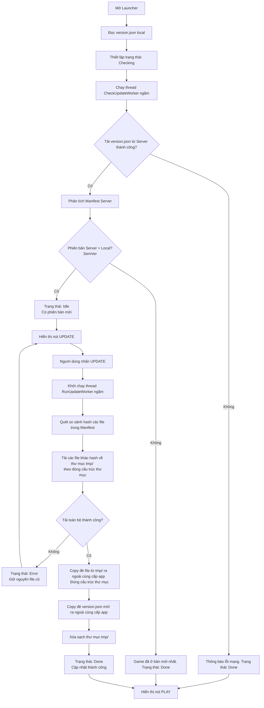

# Thiết kế Hệ thống Tự động Kiểm tra Phiên bản và Cập nhật Bất đồng bộ

Tài liệu này đặc tả thiết kế kỹ thuật cho tính năng tự động kiểm tra phiên bản lúc khởi động ứng dụng LauncherJX, tải cập nhật các file khác hash về thư mục tạm `tmp`, sau đó cài đặt chúng ra thư mục cùng cấp với ứng dụng.

## 1. Yêu cầu Hệ thống

1. **Tự động kiểm tra phiên bản lúc khởi động:** Khi mở ứng dụng, thực hiện tải file `version.json` từ GitHub Release mới nhất về một vị trí tạm để so sánh phiên bản (SemVer).
2. **Cập nhật bất đồng bộ (Non-blocking UI):** Quá trình kiểm tra phiên bản diễn ra ngầm dưới background thread để tránh đơ giao diện người dùng.
3. **So sánh phiên bản thông minh (SemVer):** Hỗ trợ so sánh phiên bản theo định dạng SemVer như `v1.0.0`, `v1.0.1` để quyết định xem có cập nhật hay không.
4. **Tải và cài đặt an toàn:** 
   - Chỉ tải các file có mã hash SHA-256 khác với file local (hoặc file local chưa tồn tại).
   - Tải các file này về thư mục tạm `tmp` nhưng giữ nguyên cấu trúc thư mục con (ví dụ: `tmp/data/config.ini`).
   - Sau khi tất cả các file tải về thành công, copy đè toàn bộ ra thư mục cùng cấp với ứng dụng theo đúng cấu trúc.
   - Ghi đè file `version.json` local bằng file từ server và xóa thư mục tạm `tmp`.
5. **Ủy thác xử lý lỗi mạng:** Nếu không kết nối được tới server để check update, thông báo lỗi kết nối nhưng vẫn cho phép nhấn nút **PLAY** để vào game bằng phiên bản hiện tại.
6. **Cải tiến công cụ tạo Manifest:** Script `tools/generate_manifest.py` tự động phát hiện thư mục `patch` ở thư mục cha, đọc phiên bản cũ, hỗ trợ nhập phiên bản mới từ bàn phím, quét và băm SHA-256 các file cùng cấp/con của thư mục `patch` (ngoại trừ `version.json`).

---

## 2. Thiết kế Luồng Dữ liệu & Trạng thái

### Sơ đồ luồng cập nhật (Activity Diagram)



---

## 3. Thiết kế Chi tiết Mã nguồn C++

### A. Hàm tiện ích so sánh phiên bản (SemVer)
Thêm hàm so sánh SemVer trong `cpp/src/update.cpp`:
```cpp
int CompareSemanticVersion(const std::string& v1, const std::string& v2);
```
- **Thuật toán:**
  1. Loại bỏ các tiền tố phi số ở đầu (như `v`, `V`, khoảng trắng).
  2. Tách chuỗi bằng ký tự `.`.
  3. Lần lượt chuyển đổi các phần thành số nguyên và so sánh.
  4. Trả về `1` nếu `v1 > v2`, `-1` nếu `v1 < v2`, `0` nếu bằng nhau.

### B. Thay đổi trong `LauncherApp` (`cpp/include/launcher_app.h` và `cpp/src/launcher_app.cpp`)

#### 1. Cấu trúc lớp `LauncherApp`:
```cpp
class LauncherApp {
public:
    // ... các hàm hiện tại ...
    void Initialize(const std::wstring& exe_dir);
    void StartUpdate();
    void Shutdown() noexcept;

private:
    void RunCheckWorker();  // Thread kiểm tra phiên bản
    void RunUpdateWorker(); // Thread tải & cài đặt cập nhật
    void SetSnapshot(const launcher::update::UpdateSnapshot& snapshot);

    std::atomic<bool> running_{true};
    mutable std::mutex snapshot_mutex_;
    launcher::update::UpdateSnapshot snapshot_{};
    std::wstring exe_dir_;
    std::string version_string_; // Phiên bản local hiện tại
    
    // Manifest của server đã tải về thành công
    launcher::update::Manifest server_manifest_;
    bool has_update_ = false;

    std::thread check_thread_;
    std::thread update_thread_;
};
```

#### 2. Logic `Initialize`:
- Đọc `version.json` local. Nếu không tìm thấy, gán `version_string_ = "v0.0.0"`.
- Đặt trạng thái ban đầu: `UpdatePhase::Checking`, tin nhắn: `"Dang kiem tra ban cap nhat..."`.
- Khởi tạo thread: `check_thread_ = std::thread(&LauncherApp::RunCheckWorker, this);`.

#### 3. Logic `RunCheckWorker`:
- Tải file `version.json` từ server về lưu tạm tại `<exe_dir>/tmp/version.json`.
- Nếu tải thất bại:
  - Đặt trạng thái: `UpdatePhase::Done`, tin nhắn: `"Khong the ket noi den server. Su dung phien ban hien tai."`
  - Đặt `has_update_ = false`.
  - Kết thúc thread.
- Nếu tải thành công:
  - Phân tích cú pháp file vừa tải thành `server_manifest_`.
  - So sánh `server_manifest_.version` with `version_string_` (Local).
  - Nếu `server_manifest_.version` lớn hơn `version_string_`:
    - Đặt trạng thái: `UpdatePhase::Idle`, tin nhắn: `"Co phien ban moi: [Server Version]. Vui long nhan UPDATE."`
    - Đặt `has_update_ = true`.
  - Ngược lại:
    - Xóa thư mục `tmp` và file tạm.
    - Đặt trạng thái: `UpdatePhase::Done`, tin nhắn: `"Game da o phien ban moi nhat!"`
    - Đặt `has_update_ = false`.

#### 4. Logic `StartUpdate`:
- Kiểm tra nếu `has_update_` là true thì mới chạy `update_thread_ = std::thread(&LauncherApp::RunUpdateWorker, this);`.

#### 5. Logic `RunUpdateWorker`:
- Sử dụng `server_manifest_` đã lưu trong bộ nhớ để so sánh hash các file.
- So sánh hash của từng file trong `server_manifest_.files` với file tương ứng tại `<exe_dir>/<file.name>`.
- Nếu hash khác nhau hoặc file local chưa có, đưa vào danh sách tải.
- Tải từng file về `<exe_dir>/tmp/<file.name>`.
- Nếu tải thành công toàn bộ:
  - Copy toàn bộ file từ `tmp` đè ra `<exe_dir>`.
  - Ghi đè file `<exe_dir>/tmp/version.json` vào `<exe_dir>/version.json`.
  - Xóa sạch thư mục `tmp`.
  - Cập nhật biến `version_string_ = server_manifest_.version`.
  - Đặt trạng thái: `UpdatePhase::Done`, tin nhắn: `"Cap nhat hoan tat! He thong da san sang."`.
- Nếu có file tải lỗi:
  - Đặt trạng thái: `UpdatePhase::Error`, tin nhắn: `"Loi tai file: [tên file]."`
  - Không copy đè, giữ nguyên phiên bản cũ.

---

## 4. Thiết kế Chi tiết Script Python `tools/generate_manifest.py`

Cải tiến script để chạy tương tác và tự động tìm thư mục:
1. **Tự động tìm thư mục:** 
   - `script_dir = os.path.dirname(os.path.abspath(__file__))`
   - `patch_dir = os.path.abspath(os.path.join(script_dir, "..", "patch"))`
2. **Đọc phiên bản cũ:** 
   - Đọc file `<patch_dir>/version.json` để lấy phiên bản cũ.
3. **Nhập phiên bản mới từ người dùng:**
   - Hỏi qua console: `Nhập phiên bản mới (Nhấn Enter để giữ nguyên [Phiên bản cũ]): `
4. **Tính toán hash:**
   - Quét đệ quy tất cả các file trong thư mục `patch_dir`.
   - Bỏ qua file `version.json`.
   - Tính toán hash SHA-256 của từng file.
   - Định dạng tên file tương đối bằng cách sử dụng dấu gạch chéo xuôi `/` thay vì gạch chéo ngược `\` (trên Windows) để đảm bảo tính tương thích đa nền tảng.
5. **Ghi manifest:**
   - Lưu cấu trúc Manifest dạng JSON thụt lề vào `<patch_dir>/version.json`.

---

## 5. Kế hoạch Kiểm thử (Verification Plan)

### A. Kiểm thử Tự động (Automated tests)
- Viết unit test cho hàm `CompareSemanticVersion` trong `cpp/tests` để bao phủ các trường hợp:
  - Phiên bản bằng nhau (`v1.0.0` vs `1.0.0`).
  - Phiên bản lớn hơn (`v1.1.0` vs `v1.0.9`).
  - Phiên bản có số chữ số khác nhau (`v1.0` vs `v1.0.1`).
  - Ký tự không hợp lệ ở đầu (`v1.0.0` vs `version 1.0.0`).

### B. Kiểm thử Thủ công (Manual verification)
1. **Trường hợp Game đã ở phiên bản mới nhất:**
   - Đặt version local trùng với version server.
   - Mở Launcher, đảm bảo Launcher tự động check và hiển thị nút **PLAY**.
2. **Trường hợp Có phiên bản cập nhật mới:**
   - Chạy script python để sinh file `version.json` mới với phiên bản cao hơn (ví dụ `v1.0.1`), đẩy lên server giả lập hoặc sửa đổi file local cũ hơn.
   - Mở Launcher, đảm bảo Launcher hiển thị nút **UPDATE** và tin nhắn thông báo có phiên bản mới.
   - Nhấn nút **UPDATE**, tiến trình tải sẽ chạy và cập nhật các file vào thư mục `tmp`, sau đó ghi đè ra ngoài cùng cấp với Launcher.
   - Kiểm tra các file đã được ghi đè đúng vị trí cùng cấp với Launcher.
3. **Trường hợp lỗi kết nối mạng:**
   - Tạm thời sửa đổi URL của manifest server thành một địa chỉ không tồn tại.
   - Mở Launcher, đảm bảo Launcher thông báo lỗi kết nối nhưng nút **PLAY** vẫn khả dụng để vào game.
